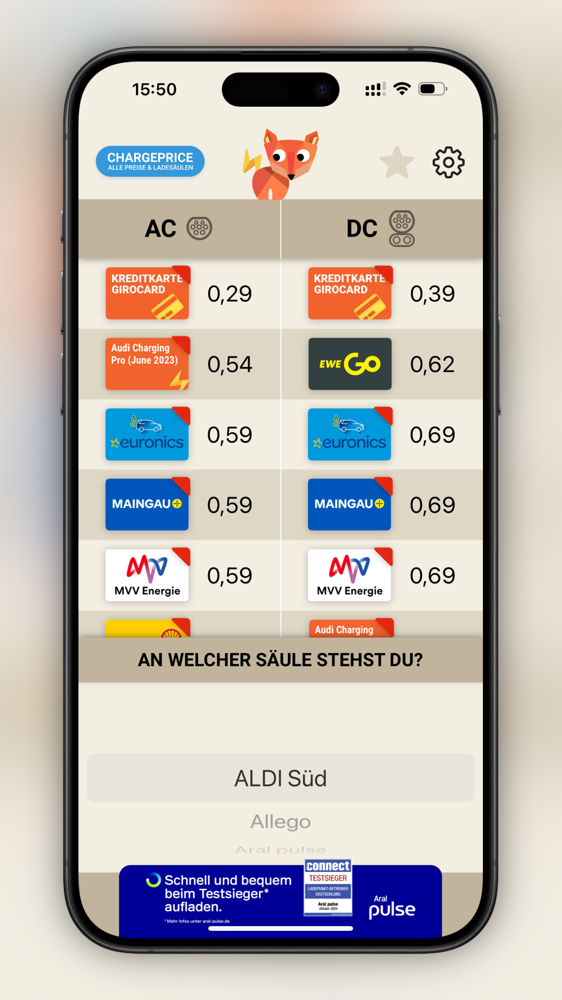
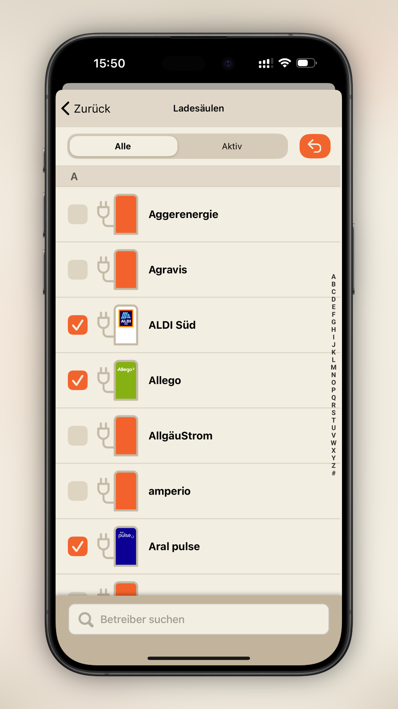
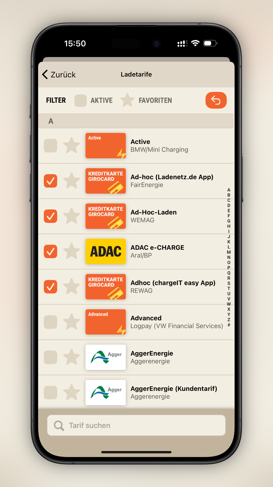

# Ladefuchs

|{ loading=lazy }|{ loading=lazy }|{ loading=lazy }|
|:-:|:-:|--:|
|||14.11.2024|

Mitarbeit 06.2020 - Heute
Gründungsmitglied, seit Anfang 2023 Team-Mitglied

Ladefuchs ist eine Non-Profit-Unternehmung. Dank ChargePrice sind wir in der Lage, Kunden von Ladesäulen mit aktuellen Ladestrom-Preisen zur jeweiligen Ladesäule anzuzeigen. Die Bedienung ist bewusst einfach gehalten, um neue EV-Fahrer:innen anzusprechen.

Meine Rolle im Projekt
Als iOS Software-Entwickler erweckte ich die erste Version des Ladefuchs zum Leben. Die App ist mittlerweile eine Cross-Plattform-Projekt, umgesetzt in React-Native.

Eingesetzte Technologien / Software