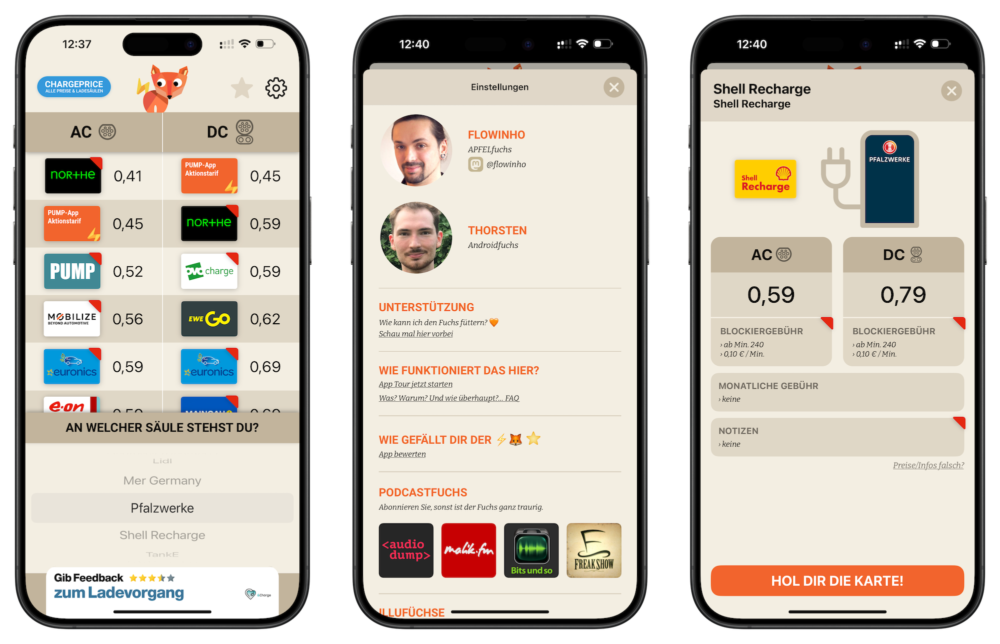

---
tags:
    - Der Software-Engineer
    - Der Podcaster
    - Ladefuchs
    - UIKit
    - Swift
    - iOS
---

# Ladefuchs - Einfach schlau laden

<figure markdown="span">
  { loading=lazy }
  <figcaption>Die Übersichtsseite, die Einstellungen und eine Detaildarstellung eines Tarifs, aufgenommen am 03.12.24.</figcaption>
</figure>

---

    
    
    
    
    
    
    
    
    
    
    
    

---

## Übersicht

!!! info "[ladefuchs.app](https://ladefuchs.app) | Was kostet der Strom für dein E-Auto?"
    
    Blitzschnell die günstigste Ladekarte finden.
    Mit einem Fingerwischen zeigt Dir der Ladefuchs die günstigste Ladekarte an der Elektro-Ladesäule.
    Nicht mehr, nicht weniger.
    Dank [ChargePrice](https://www.chargeprice.app/) sind die Daten immer aktuell.
    Die App ist kostenlos. Der kleine Ladefuchs freut sich allerdings wie ein junger Dachs über Futterspenden.
    Er fiepst dann immer ein bisschen.
    _Besucht am 04.12.24._

[Ladefuchs – Einfach schlau laden](https://ladefuchs.app) ist eine App, die in Zusammenarbeit mit [ChargePrice](https://www.chargeprice.app/) entstanden ist. Die App zeigt in ihrer aktuellen Version (04.12.2024) die aktuellen Preise für zahlreiche Ladetarife in Kombination mit der ausgewählten Ladesäule an. Sowohl das Einpflegen eigener Ladetarife, unter anderem das Laden zu Hause, als auch Informationen, die während des Ladens von Relevanz sind, wie Blockiergebühren, werden in der App dargestellt. Die Daten hierfür werden von ChargePrice geliefert. Die Betriebskosten werden durch das Einblenden von Werbebannern und der Vermittlung der THG-Quote gedeckt.

## Meine Rolle im Projekt

!!! info inline end "Programmiertätigkeit 2021 beendet."

    Seit dem Wandel zu React Native habe ich nicht mehr am Ladefuchs für iOS mitprogrammiert.   

    _Ich bleibe weiterhin in meiner Rolle als Mitgründer ein Teil des Teams und bin in Entscheidungen einbezogen._

Die Grundidee dazu kam von Malik Aziz[^1] und Bastian Wölfle[^2]. Die beiden suchten 2020 Unterstützung zur Implementierung der iOS-App, um die App zügig auf den Markt zu bringen und als großer Befürworter von Elektromobilität ergriff ich diese Chance in der Hoffnung, Elektromobilität für die breite Masse zugänglicher zu machen.
Zu dritt legten wir damals los. Bastian übernahm die Implementierung der Android-App und ich die Implementierung der iOS-App. In der Zwischenzeit ist das Team gewachsen und die Entwicklung der mobilen Anwendung wird für die Plattform iOS nicht mehr von mir durchgeführt. Um die zunehmenden Versionsunterschiede zwischen iOS und Android leichter angleichen zu können, wurde die damals noch von mir nativ entwickelte Version des Ladefuchs für iOS durch eine plattformunabhängige Implementierung in React Native ersetzt. 

[^1]: [Malik Aziz, malik-aziz.de](https://www.malik-aziz.de/)
[^2]: [Bastian Wölfle, schlingel.de](https://www.schlingel.de/)

## Besondere Herausforderungen

### Open-Source-Entwicklung dauerte länger als erwartet 

Eine der Grundideen des Ladefuchs ist, Transparenz zu schaffen. Um der Gemeinschaft etwas zurückzugeben, sollte der Code in einem Open-Source-Repository zur Verfügung gestellt werden. Allerdings mussten einige Hürden genommen werden, bevor das letztendlich möglich wurde. 

- Die Ladekarten und die damit verbundenen Logos der Stromnetzbetreiber konnten wir nicht ohne Nachzudenken veröffentlichen, da die Rechte zur Distribution der Logos nicht bei uns lagen. Ein Backend zur Verwaltung der Grafiken musste geschaffen werden.
- Das von uns geschaffene Backend musste abgesichert werden, um Missbrauch durch Dritte vorzubeugen.

### Privacy First bedeutet Mehraufwand auf unserer Seite

Aufgrund unserer Kooperation mit ChargePrice und weiteren Firmen ist es notwendig, AdImpressions[^3] zu sammeln. 

[^3]: [AdImpressions, de.wikipedia.org](https://de.wikipedia.org/wiki/Ad_Impression)

!!! warning "Privacy First"

    Für das Team hinter dem Ladefuchs ist Privacy First einer der obersten Grundsätze, weshalb wir uns grundsätzlich gegen das Einbetten von Trackingsoftware entschieden haben. 

Um dennoch Kennzahlen an unsere Partner übermitteln zu können, kam es zu einer Verzögerung, da wir unsere eigene Form der Datenerfassung implementieren mussten, um das Gebot der Datensparsamkeit zu erfüllen.

## Architektur

Die eingesetzte Architektur war in diesem Fall MVC mit Übernahme von mehreren "Best Practices". 
Die ursprüngliche Annahme für die Lebensdauer des Projekts war ein bis zwei Jahre. Da die Time-to-Market 
zu den höchsten Prioritäten gehörte und Qualität zunächst nicht im Vordergrund stand, habe ich mich für 
jenes Konzept entschieden, welches Apple damals am stärksten im Rahmen der Entwicklung von Apps mit UIKit bewarb: MVC. 
Apples damals starker Fokus auf MVC im iOS-SDK erleichterte es, einfachere Apps in hoher Geschwindigkeit zu erstellen. 

## Eingesetzte Technologien

|Technologie|Anwendung|
|:--|:--|
|Alamofire|Leistungstarker HTML- und REST-Client, dessen Integration die Anbindung der Ladefuchs-API stark beschleunigte.|
|UIKit|SwiftUI war damals noch nicht ausgereift genug, um problemlos und schnell eingebunden werden zu können. Zudem verfügte ich über langjährige Erfahrung mit UIKit.|
|Swift Package Manager|SPM war bereits 2020 Legacy-Dependencymanagern wie CocoaPods und Carthage überlegen.|

## Quellcode und Downloadlinks

|Plattform|Link|
|:--|:--|
|:simple-github: GitHub|[https://github.com/Team-Ladefuchs/ladefuchs-react-native](https://github.com/Team-Ladefuchs/ladefuchs-react-native)|
|:simple-googleplay: Google Play|[https://play.google.com/store/apps/dev?id=9099114460681423830&hl=de](https://play.google.com/store/apps/dev?id=9099114460681423830&hl=de)|
|:simple-appstore: Apple AppStore|[https://f-droid.org/packages/app.ladefuchs.android/](https://f-droid.org/packages/app.ladefuchs.android/)|
|:simple-fdroid: F-Droid|[https://apps.apple.com/de/app/ladefuchs/id1522882164](https://apps.apple.com/de/app/ladefuchs/id1522882164)|

## Pressestimmen

!!! quote "Chip.de | [Strompreis-Chaos an der Ladesäule: So finden Sie den günstigsten Tarif, 30.08.23](https://www.chip.de/news/Strompreis-Chaos-an-der-Ladesaeule-So-finden-Sie-den-guenstigsten-Tarif_184199218.html)"

    Einfach wie E-Mobilität sein sollte. [..] Die Lösung ist, als E-Fahrer mehrere Ladekarten vorzuhalten und die Passende zu zücken. Die App Ladefuchs macht den Preisvergleich unter 10 Anbietern, wenn Sie an der Ladesäule stehen. Ladefuchs ist aber auch nützlich zur Vorbereitung für Autofahrer, die auf ein E-Auto umsteigen wollen.   
    _Besucht am 03.12.24_

!!! quote "matthias-petrat.com | [Ladefuchs-App – Elektroautos immer mit dem günstigsten Tarif laden, 25.02.21](https://www.matthias-petrat.com/ladefuchs-app-elektroautos-immer-mit-dem-guenstigsten-tarif-laden/)"

    Von daher solltet ihr euch als Fahrer eines E-Autos unbedingt die Ladefuchs-App auf eurem iPhone oder Android-Smartphone installieren und bei den nächsten Fahrten mal testen. Ich finde dieses Projekt wirklich cool, denn es löst einfach, schnell und kostenfrei ein Übersichtsproblem.   
    _Besucht am 03.12.24_