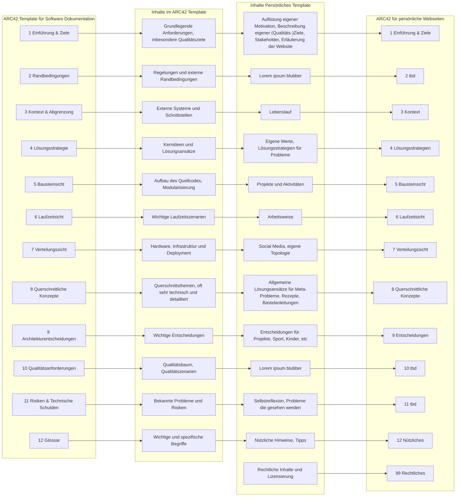

# Aufbau der Website

## Mapping

[https://www.arc42.de/overview/](https://www.arc42.de/overview/)

Was ist das Software-Produkt? Ich und diese Website

```mermaid
flowchart LR
    subgraph arc42-software[ARC42 Template für Software Dokumentation]
        oGoals[1 Einführung & Ziele]
        oConstraints[2 Randbedingungen]
        oContext[3 Kontext & Abgrenzung]
        oSolution[4 Lösungsstrategie]
        oBlocks[5 Bausteinsicht]
        oRuntime[6 Laufzeitsicht]
        oDistribution[7 Verteilungssicht]
        oCross[8 Querschnittliche Konzepte]
        oArc[9 Architekturentscheidungen]
        oQA[10 Qualitätsanforderungen]
        oRisks[11 Risiken & Technische Schulden]
        oGlossar[12 Glossar]
    end

    subgraph oContent[Inhalte im ARC42 Template]
        ocGoals[Grundlegende Anforderungen, inbesondere Qualitätsziele]
        ocConstraints[Regelungen und externe Randbedingungen]
        ocContext[Externe Systeme und Schnittstellen]
        ocSolution[Kernideen und Lösungsansätze]
        ocBlocks[Aufbau des Quellcodes, Modularisierung]
        ocRuntime[Wichtige Laufzeitszenarien]
        ocDistribution[Hardware, Infrastruktur und Deployment]
        ocCross[Querschnittsthemen, oft sehr technisch und detailliert]
        ocArc[Wichtige Entscheidungen]
        ocQA[Qualitätsbaum, Qualitätszenarien]
        ocRisks[Bekannte Probleme und Risiken]
        ocGlossar[Wichtige und spezifische Begriffe]
    end

    subgraph nContent[Inhalte Persönliches Template]
        ncGoals["Auflistung eigener Motivation, Beschreibung eigener (Qualitäts-)Ziele, Stakeholder, Erläuterung der Website"]
        ncConstraints[Lorem ipsum blubber]
        ncContext[Lebenslauf]
        ncSolution[Eigene Werte, Lösungsstrategien für Probleme]
        ncBlocks[Projekte und Aktivitäten]
        ncRuntime[Arbeitsweise]
        ncDistribution[Social Media, eigene Topologie]
        ncCross[Allgemeine Lösungsansätze für Meta-Probleme, Rezepte, Bastelanleitungen]
        ncArc[Entscheidungen für Projekte, Sport, Kinder, etc]
        ncQA[Lorem ipsum blubber]
        ncRisks[Selbstreflexion, Probleme die gesehen werden]
        ncGlossar[Nützliche Hinweise, Tipps]
        ncLegal[Rechtliche Inhalte und Lizensierung]
    end

    subgraph arc42-personal[ARC42 für persönliche Webseiten]
        nGoals[1 Einführung & Ziele]
        nConstraints[2 tbd]
        nContext[3 Kontext]
        nSolution[4 Lösungsstrategien]
        nBlocks[5 Bausteinsicht]
        nRuntime[6 Laufzeitsicht]
        nDistribution[7 Verteilungssicht]
        nCross[8 Querschnittliche Konzepte]
        nArc[9 Entscheidungen]
        nQA[10 tbd]
        nRisks[11 tbd]
        nGlossar[12 Nützliches]
        nLegal[99 Rechtliches]
    end

    oGoals ----> ocGoals --> ncGoals ----> nGoals
    oConstraints ----> ocConstraints --> ncConstraints ----> nConstraints
    oContext ----> ocContext --> ncContext ----> nContext
    oSolution ----> ocSolution --> ncSolution ----> nSolution
    oBlocks ----> ocBlocks --> ncBlocks ----> nBlocks
    oRuntime ----> ocRuntime --> ncRuntime ----> nRuntime
    oDistribution ----> ocDistribution --> ncDistribution ----> nDistribution
    oCross ----> ocCross --> ncCross ----> nCross
    oArc ----> ocArc --> ncArc ----> nArc
    oQA ----> ocQA --> ncQA ----> nQA
    oRisks ----> ocRisks --> ncRisks ----> nRisks
    oGlossar ----> ocGlossar --> ncGlossar ----> nGlossar
    ncLegal --> nLegal
```