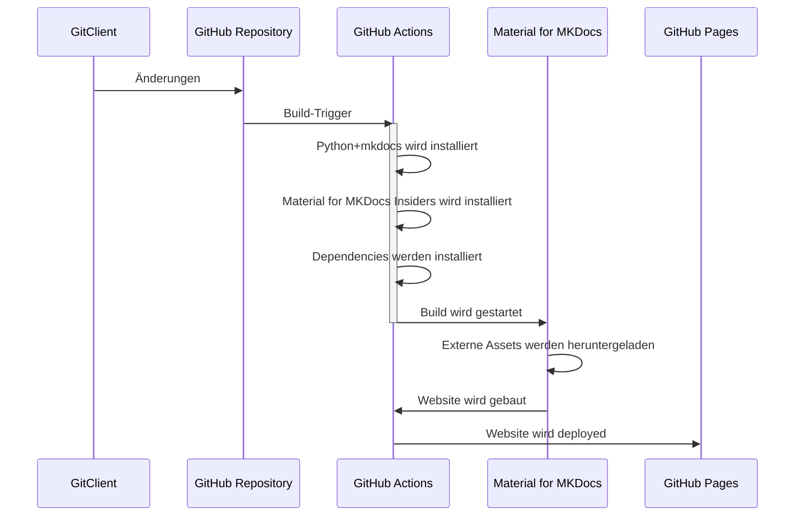
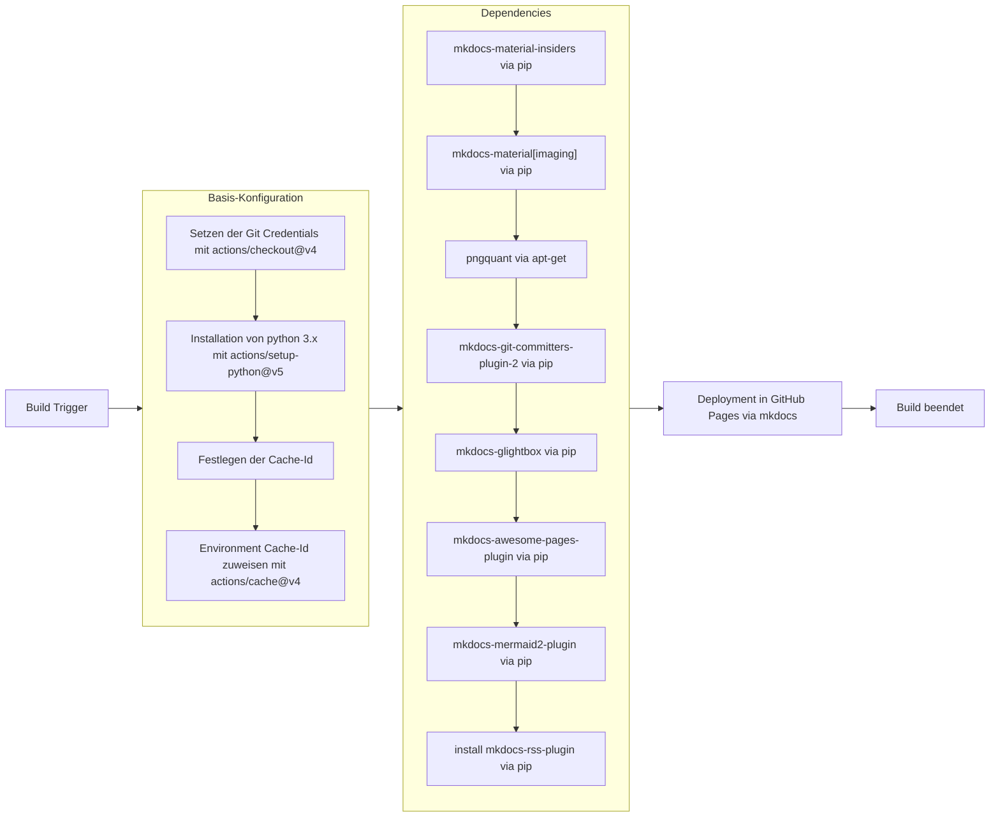

# Die Pipeline dieser Website

## Vereinfachte Darstellung

```mermaid
sequenceDiagram
    participant gc as GitClient
    participant gr as GitHub Repository
    participant ga as GitHub Actions
    participant mk as Material for MKDocs
    participant gp as GitHub Pages
    
    gc->>gr: Änderungen 
    gr->>ga: Build-Trigger
    activate ga
    ga->>ga: Python+mkdocs wird installiert
    ga->>ga: Material for MKDocs Insiders wird installiert
    ga->>ga: Dependencies werden installiert
    ga->>mk: Build wird gestartet
    deactivate ga
    mk->>mk: Externe Assets werden heruntergeladen
    mk->>ga: Website wird gebaut
    ga->>gp: Website wird deployed
```

## Der GitHub Actions Workflow

### Grafische Darstellung

```mermaid
flowchart LR
    start["Build Trigger"]

    subgraph base["Basis-Konfiguration"]
        direction TB
        git["Setzen der Git Credentials mit actions/checkout@v4"]
        python["Installation von python 3.x mit actions/setup-python@v5"]
        cacheid["Festlegen der Cache-Id"]
        cache["Environment Cache-Id zuweisen mit actions/cache@v4"]

        git --> python
        python --> cacheid
        cacheid --> cache
    end

    start --> base

    subgraph setup[Dependencies]
        direction TB
        mkdocs["mkdocs-material-insiders via pip"]
        imaging["mkdocs-material[imaging] via pip"]
        png["pngquant via apt-get"]
        authors["mkdocs-git-committers-plugin-2 via pip"]
        lightbox["mkdocs-glightbox via pip"]
        pages["mkdocs-awesome-pages-plugin via pip"]
        mermaid["mkdocs-mermaid2-plugin via pip"]
        rss["install mkdocs-rss-plugin via pip"]
        
        mkdocs --> imaging
        imaging --> png
        png --> authors
        authors --> lightbox
        lightbox --> pages
        pages --> mermaid
        mermaid --> rss
    end

    base --> setup
    deploy["Deployment in GitHub Pages via mkdocs"]
    setup --> deploy
    finish["Build beendet"]
    deploy --> finish
```
