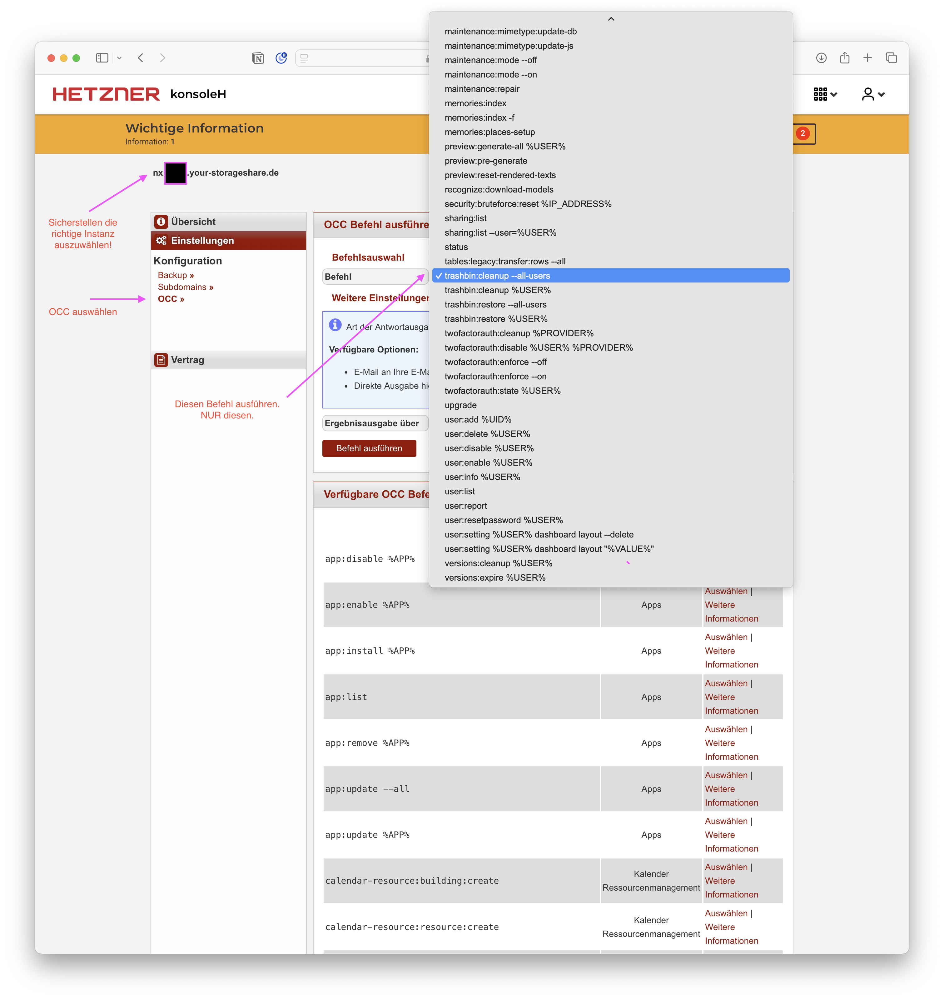

# StorageShare: Papierkorb und Versionierung leeren

Nutzer:innen einer Hetzner StorageShare haben den Schritt gewagt und die Selbstverwaltung ihrer Dateien selbst in die Hand genommen. Ob Einzelperson, Familie, Band oder Unternehmen, ich unterstütze jede Person, die sich dieses Projekts angenommen hat und nun mit einer eigenen Nextcloud-Instanz arbeitet.

Wie bei jeder Software gibt es ein paar Dinge zu beachten. In diesem Fall: Versionierung und Papierkörbe. Denn Dateien in Nextcloud zu löschen entfernt diese nicht zwingend vom Server. In den meisten Fällen ist dieses Verhalten durchaus gewünscht. Wer Steuerdokumente aus Versehen gelöscht hat, die Familien-Planungstabelle verhunzt hat, oder die Hausfinanzierung löscht, der freut sich über die Versionierung.

Problematisch wird das Ganze über Zeit, oder wenn große Dateien verarbeitet werden. Hier ist es wichtig, die Papierkörbe und Versionen der Nextcloud in regelmäßigen Intervallen zu leeren.

## Papierkorb leeren

<figure markdown="span">
  {: width=700px }
  <figcaption>Darauf achten, nicht den falschen Befehl auszuführen. Flüchtigkeitsfehler sind bei OCC-Befehlen fatal.
</figcaption>
</figure>

1. Loggt euch in Hetzner KonsoleH ein.
2. Stellt sicher die richtige StorageShare-Instanz auszuwählen, falls ihr mehrere besitzen solltet.
3. Wählt im Reiter "Einstellungen" das Feld "OCC"
4. Führt den Befehl trashbin:cleanup --all-users aus.

## Versionskontrolle zurücksetzen

Um die Versionsprotokolle zu löschen, kann nach Abschluss oder statt dem Befehl zur Leerung der Papierkörbe anschließend `versions:cleanup %USER%` ausgeführt werden.