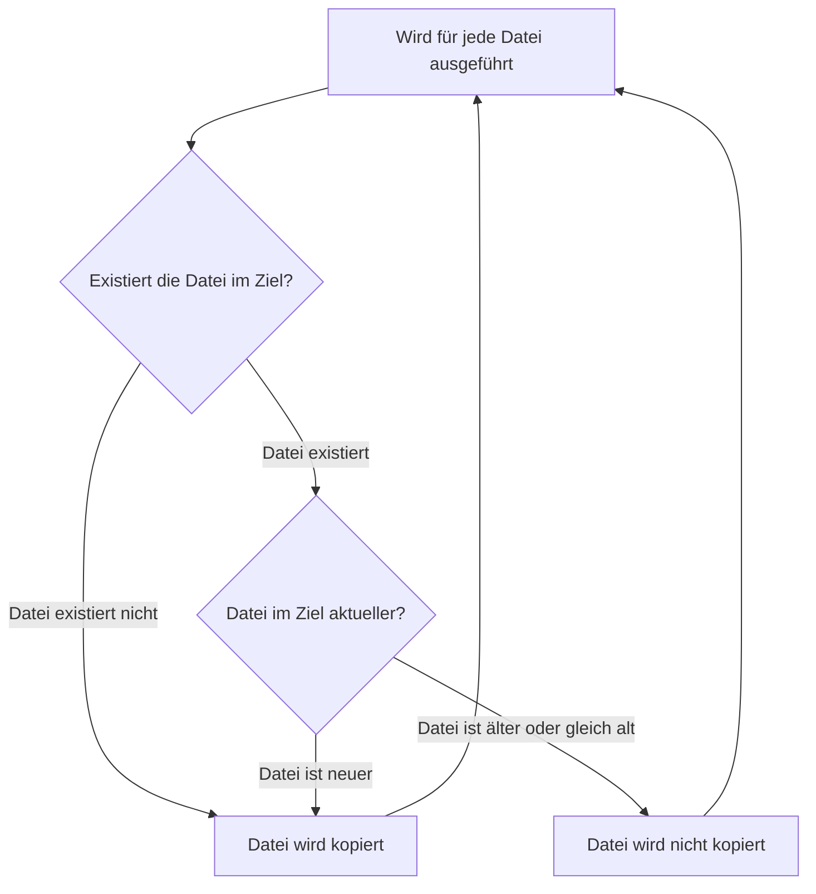

# Zwei Verzeichnisse mit rsync synchronisieren


## Anforderungen

- Alle Verzeichnisse und Unterverzeichnisse sollen verglichen werden.
- Nur Dateien die auf dem Ziel nicht vorhanden sind, sollen kopiert werden.
- Wenn im Ziel eine neuere Version einer Datei vorliegt, soll die ältere Version der Datei die neuere Datei nicht ersetzen.
- Im Zielverzeichnis soll nichts gelöscht werden.

## Grafische Aufschlüsselung



## Rsync-Switches ausführlicher erklärt

- `a` steht **Archive**. Dieser Befehl ist eine Kurzform von `rlptgoD`. Kopiert rekursiv und behält Nutzer, Gruppen, Dateiberechtigungen und Zeitstempel bei.
    - `r` steht für **recursive**, geht in jedes Verzeichnis und dessen Unterverzeichnisse und untersucht deren Inhalte.
    - `l` kopiert Sym**links** als Symlinks
    - `p` steht für **permissions**. bewahrt also die Zugriffsberechtigungen der Dateien.
    - `t` bewahrt die **timestamps**, also die Zeitstempel wann die Dateien geändert wurden (enorm wichtig).
    - `g` bewahrt die **groups**, also die Nuzergruppen der Datei,
    - `o` verhindert, dass der **owner** der Datei geändert wird.
    - `D` steht für:
        - `--devices` bewahrt Dateien die zu einem bestimmten Gerät gehören.
        - `--specials` sonstige Dateien, die vielleicht relevant sein könnten.
- `u`, oder auch `--update` kopiert nur Dateien, die **neuer sind als auf dem Zielgerät**.
- `v` Gibt den aktuellen Stand aus, listet Dateien auf.
- `h`, Ausgabe wird lesbarer für Menschen
- `p` oder `--progress` gibt den Gesamtfortschritt aus.
- `--dry-run` führt den gesamten Vorgang erstmal als Simulation aus, ohne wirklich Dateien zu verschieben.

Das Problem mit `ignore existing` und `update` im selben Befehl: Wenn bereits existierende Dateien ignoriert werden, werden sie nicht mehr verglichen. Neuere Änderungen werden also nicht übernommen.

Der gesamte Befehl für die Simulation wäre also:

```bash
rsync -avhpu --dry-run source/ destination/
```

Der eigentliche Vorgang dann natürlich ohne `--dry-run`.