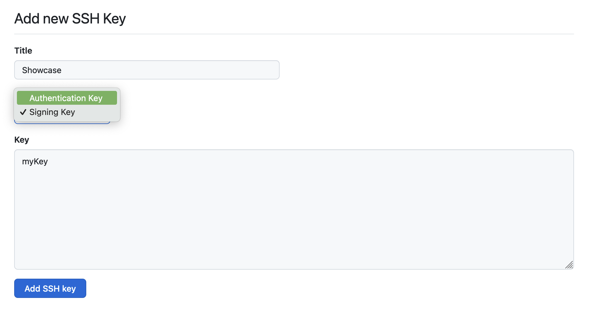

# GitHub Commits mit SSH-Keys signieren

Als ersten Schritt sollten Entwickler:innen einen SSH-Key mittels ED25519 generieren, da dieser Algorithmus RSA ablöst. Hier gilt es zu beachten, dass nicht alle Systeme mit auf ED25519 basierenden SSH-Keys kompatibel sind. Prinzipiell handelt es sich bei diesem Artikel aber um eine Anleitung zur Signierung von Commits innerhalb von Repositories auf GitHub. GitHub versteht ED25519.

## SSH Key generieren

Der SSH-Key sollte mit einem Passwort versehen werden, welches ihr während der Generierung griffbereit haben müsst. Es ist "best practice" SSH-Keys für bestimmte Anwendungsfälle zu generieren. Daher empfehle ich, einen spezifischen Dateinamen für den Key zu wählen, beispielsweise `github_ed25519` oder ähnliches. 

```bash
ssh-keygen -t ed25519

// Ausgabe
Generating public/private ed25519 key pair.
Enter file in which to save the key (/Users/user/.ssh/id_ed25519): keyname
Enter passphrase (empty for no passphrase):
Enter same passphrase again:
Your identification has been saved in keyname
Your public key has been saved in keyname.pub
The key fingerprint is:
SHA256:aNh8cTg1fzUWOeEREk3eMPek8+YHrHCVSq9v34QN+vg user@machine
The key's randomart image is:
+--[ED25519 256]--+
|          o  o*OO|
|         o o  =%=|
|        + . o *o+|
|     + . + . * o |
|    . = S . o = o|
|     . .   o + B |
|            + . =|
|             +..o|
|            .oE.o|
+----[SHA256]-----+
```

## GitHub konfigurieren

Kopiert den Inhalt des Public Key in die Zwischenablage, um diesen ins GitHub-Frontend eintragen zu können.

```bash
cat ~/.ssh/keyname.pub | pbcopy
```

<figure markdown="span">
  {: width=700px }
  <figcaption>Es ist wichtig, den SSH-Key als Signing Key anzulegen.</figcaption>
</figure>

Dieser Schlüssel muss nun bei GitHub hinterlegt werden, damit er eurem Account und euren Commits zugeordnet werden kann. Navigiert dazu zum Bereich "SSH und GPG-Schlüssel" in euren Einstellungen und wählt den Knopf "SSH-Key hinzufügen".

## Lokale Konfiguration

Damit die Commits auch signiert werden können, muss git über die Nutzung des Keys Bescheid wissen und entsprechend konfiguriert werden. Standardmäßig nutzt git den Standard OpenGPG zur Signierung von Commits, daher muss, zusätzlich zur allgemeinen Konfiguration, mitgeteilt werden, dass Commits mit dem SSH-Key konfiguriert werden sollen, statt mit GPG.

Hinweise:

1. Es ist allgemein zu empfehlen, alle Commits aller Repositories zu signieren, um einer erneuten Konfiguration des Signing-Prozesses auf Basis einzelner Repositories zu entgehen. Selbstverständlich kann es gewünscht sein, die Signierung von Commits auf Basis jedes Repository separat zu steuern. Dafür einfach den Switch `--global` in den unten aufgeführten Befehlen weglassen.
1. Manche Tools wie GitHub Desktop benötigen es für ihre Funktionalität, dass generell alle Commits eines Repositories signiert werden, während andere eine feiner granulierte Konfiguration ermöglichen. Dieser Guide bezieht sich auf die CLI-Implementierung von `git`.

```bash
// SSH als Signierungs-Verfahren festlegen
git config --global gpg.format ssh

// Den Pfad zum Key festlegen
git config --global user.signingkey ~/.ssh/keyname.pub

// Standardmäßig alle Commits signieren
git config --global commit.gpgsign true
```

Sollte es unter macOS Probleme mit dem Key geben, genügt es in den allermeisten Fällen den Key zum SSH-Agent hinzuzufügen.

```bash
ssh-add ~/.ssh/keyname
```

Weitere Schritte sind nicht notwendig.