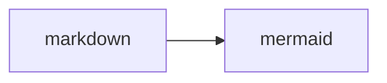

---
tags:
  - Mermaid
  - Material for MKDocs
---

# Mermaid2 Plugin in mkdocs-Material einrichten

## Dependencies

```bash title="Plugin über pip installieren"
pip install mkdocs-mermaid2-plugin
```

## Konfiguration

```yaml title="mkdocs.yml" linenums="1"
  - pymdownx.extra:
      pymdownx.superfences:
        custom_fences:
          - name: mermaid
            class: mermaid
            format: !!python/name:mermaid2.fence_mermaid_custom
            #format: !!python/name:mermaid2.fence_mermaid # Plain Mermaid, without Material Theme
```

## Nutzung

Über herkömmliche Codeblöcke mit Triple-Backtick. Baut auf dem Superfence-Plugin auf.

````markdown

````


## Lessons learned

- Workaround zur Theme-Steuerung auf Webseite funktioniert nicht.
- Plugin ermöglich Nutzung der offiziellen Themes, aber diese respektieren Light- / Darkmode nicht.