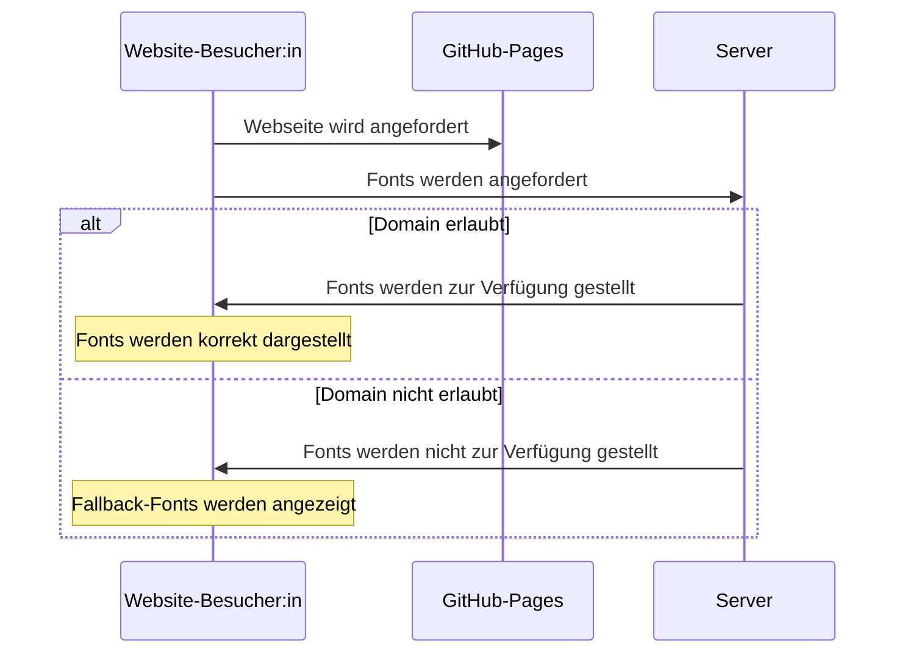

---
tags:
    - Apache
    - Server
---

# CORS Konfigurieren um Ressourcen auf separatem Webserver zu hosten

Standardmäßig blocken Browsers Ressourcen die von anderen Domains als der Domain der aktuell besuchen Website kommen.
Das ist ein wichtiges Sicherheitsfeature. Manchmal ist es allerdings gewünscht, Ressourcen auf separaten Servern zu hosten. 
Diese Webseite beispielsweise nutzt eine lizensierte Font, die aufgrund ihrer Lizenzbestimmungen nicht Teil des GitHub-Repositories sein darf.

## Ablauf des Requests auf dieser Website



## Konfiguration

Auf meinem Webserver läuft Apache. Der simpelste Weg CORS zu konfigurieren liegt darin die erlaubten Domains 
in der `.htaccess` zu hinterlegen.

```apache
# Enable cross domain access control
SetEnvIf Origin "^http(s)?://(.+\.)?(florianschuttkowski\.com|flowinho.github\.io)$" REQUEST_ORIGIN=$0
Header always set Access-Control-Allow-Origin %{REQUEST_ORIGIN}e env=REQUEST_ORIGIN
Header always set Access-Control-Allow-Methods "GET, POST, PUT, DELETE, OPTIONS"
Header always set Access-Control-Allow-Headers "x-test-header, Origin, X-Requested-With, Content-Type, Accept"

# Force to request 200 for options
RewriteEngine On
RewriteCond %{REQUEST_METHOD} OPTIONS
RewriteRule .* / [R=200,L]
```

Zugehörige Diskussion auf StackOver: [https://stackoverflow.com/questions/14467673/enable-cors-in-htaccess/](https://stackoverflow.com/questions/14467673/enable-cors-in-htaccess/)