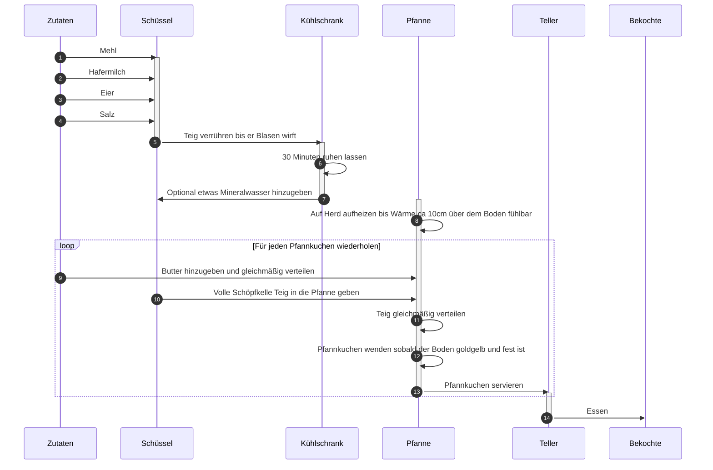

# Der einfachste Pfannkuchen der Welt

## Zutaten

Für vier Personen

|Zutat|Menge|
|:--|:--|
|Mehl|400g|
|Hafermilch[^1]|750ml|
|Eier|3 Mittelgroße bis Große|
|Butter|Für die Pfanne|
|Salz|Eine Prise|

## Zubereitung

[^1]: Oatly Barista