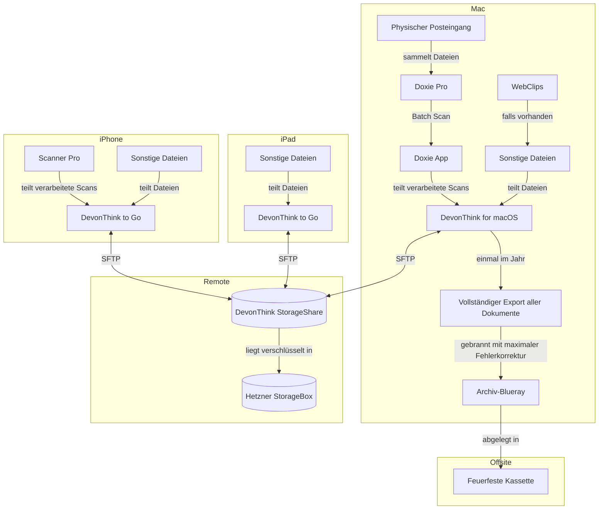
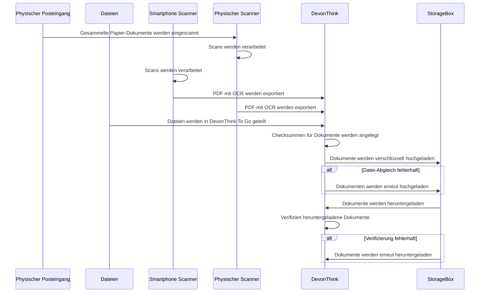

# WhiteBox: PaperLess Office mit DevonThink und Hetzner StorageBox

## Aufbau

```mermaid
flowchart TD
    subgraph Mac
        physicalInbox[Physischer Posteingang]
        physicalScanner[Doxie Pro]
        doxieApp[Doxie App]
        dmac[DevonThink for macOS]

        physicalInbox --sammelt Dateien--> physicalScanner
        physicalScanner --Batch Scan--> doxieApp
        doxieApp --teilt verarbeitete Scans-->dmac

        webclip[WebClips]--falls vorhanden-->macFiles
        macFiles[Sonstige Dateien]
        
        macFiles --teilt Dateien--> dmac

        export[Vollständiger Export aller Dokumente]
        blueray[Archiv-Blueray]
        export --gebrannt mit maximaler Fehlerkorrektur-->blueray
    end

    subgraph iPhone
        phoneFiles[Sonstige Dateien]
        phoneScanner[Scanner Pro]
        dmac2go[DevonThink to Go]

        phoneScanner --teilt verarbeitete Scans--> dmac2go
        phoneFiles --teilt Dateien--> dmac2go
    end

    subgraph iPad
        padFiles[Sonstige Dateien]
        dmac2gop[DevonThink to Go]
        
        padFiles --teilt Dateien--> dmac2gop
    end

    dmac & dmac2go & dmac2gop <--SFTP--> storageshare

    subgraph Remote
        storageshare[(DevonThink StorageShare)]
        storagebox[(Hetzner StorageBox)]
        storageshare--liegt verschlüsselt in-->storagebox
    end

    subgraph Offsite
        safe[Feuerfeste Kassette]
        blueray --abgelegt in-->safe
    end

    dmac --einmal im Jahr --> export
```

## Ablauf Dokumentenerfassung

```mermaid
sequenceDiagram
    participant i as Physischer Posteingang
    participant p as Dateien
    participant r as Smartphone Scanner
    participant s as Physischer Scanner
    participant d as DevonThink
    participant f as StorageBox

    i ->> s: Gesammelte Papier-Dokumente werden eingescannt
    s ->> s: Scans werden verarbeitet
    r ->> r: Scans werden verarbeitet
    r ->> d: PDF mit OCR werden exportiert
    s ->> d: PDF mit OCR werden exportiert
    p ->> d: Dateien werden in DevonThink To Go geteilt
    d ->> d: Checksummen für Dokumente werden angelegt
    d ->> f: Dokumente werden verschlüsselt hochgeladen
    alt Datei-Abgleich fehlerhaft
        d ->> f: Dokumenten werden erneut hochgeladen
    end

    f ->> d: Dokumente werden heruntergeladen
    d ->> d: Verifiziert heruntergeladene Dokumente

    alt Verifizierung fehlerhaft
        f ->> d: Dokumente werden erneut heruntergeladen
    end
        
```